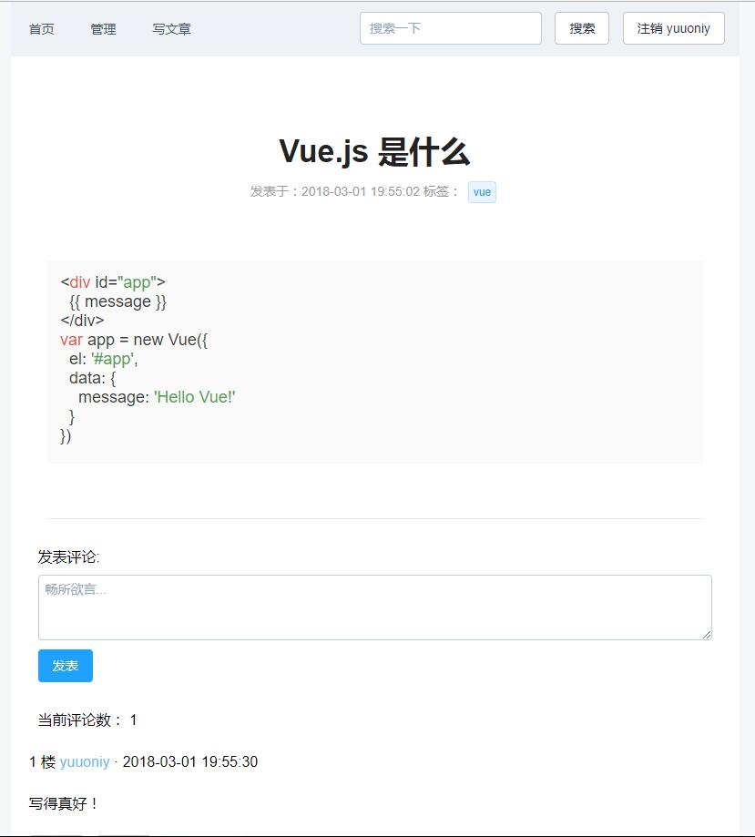

This is a optional project in Web 2.0 course, which is not practical,just for learning 
### tree
```
│  app.js
│  index.html
│  package.json
│  webpack.config.js
│
├─config
│      adminAccount.js
│
├─server
│  ├─model
│  │      db.js
│  │
│  └─router
│          index.js
│
└─src
    │  App.vue
    │  main.js
    │
    ├─assets
    │      atom-one-light.css
    │      head.jpg
    │
    ├─components
    │      article.vue
    │      articleComment.vue
    │      articleDetail.vue
    │      articleEdit.vue
    │      articleList.vue
    │      articles.vue
    │      searchResult.vue
    │      sidebar.vue
    │      signin.vue
    │      signup.vue
    │
    └─router
            index.js 
```

### run
1. `npm install` 
2. `mongod --dbpath your-atabase-path`
3. `node app` run server
4. `npm run dev` run 
5. visit `http://localhost:8080`

default admin account：  
**username**：admin   
**password**：iamadmin  

### technology stack 
#### front-end
vue、element-ui、marked、highlight.js
#### server
Node.js、express、mongodb

### function
  - two types account:
    - **general user**：
      - can edit or delete the posts or comments belong to him.
      - can't reply his own comment.
      - if comments are hidden by admin, '(内容被隐藏)' will be shown
    - **admin**：
      - have rights to hide or display all the posts and comments
      - unable to post anything

-  `Markdown` edit and **highlight** code  
- Support **brief intro** and **Tags** for ariticle.
- **Search** post(only support searching by title)
- **Pagination** 

### preview

### acknowledgments
Thanks to [FatDong1's blog](https://github.com/FatDong1/vue-blog),it helped me a lot.
